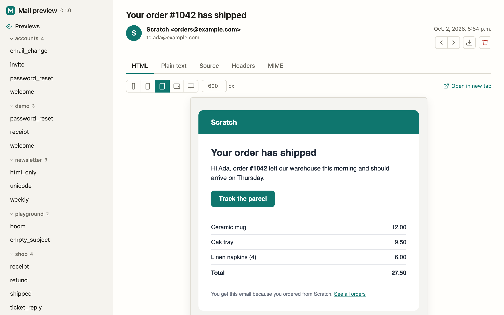

# django-mail-preview

See every email your Django app sends, rendered in the browser, without sending a
single one.

django-mail-preview is two things on one page. A capture email backend stores the
mail your app sends, so it lands in an inbox instead of reaching anyone. Preview
classes build emails from sample data without sending them, so you can look at a
password-reset mail without triggering one. Both open inside your project, on pages
that answer 404 unless `DEBUG` is on.



## Quickstart

Install the package:

```console
$ pip install django-mail-preview
```

Add the app and the capture backend to your settings:

```python
INSTALLED_APPS = [
    # ...
    "django_mail_preview",
]

# Django 6.1 and later
MAILERS = {
    "default": {"BACKEND": "django_mail_preview.backends.EmailBackend"},
}

# Django 5.2 and 6.0
EMAIL_BACKEND = "django_mail_preview.backends.EmailBackend"
```

Use the setting your Django version has: `MAILERS` is new in Django 6.1, which
deprecates `EMAIL_BACKEND`.

Include the URLs:

```python
from django.urls import include, path

urlpatterns = [
    # ...
    path("__mail-preview__/", include("django_mail_preview.urls")),
]
```

Open <http://localhost:8000/__mail-preview__/>. Every email the app sends from now on
appears there. The include needs no `if settings.DEBUG` wrapper, because the views
answer 404 unless `DEBUG` is on. See [Security](security.md).

To see an email without sending it, add a `previews.py` to one of your apps:

```python
# accounts/previews.py
from django_mail_preview import EmailPreview

from .emails import password_reset_email, welcome_email
from .models import User


class AccountEmails(EmailPreview):
    def password_reset(self):
        """Sent after the "forgot password" form."""
        user = User(first_name="Ada", email="ada@example.com")
        return password_reset_email(user)

    def welcome(self):
        return welcome_email(User(first_name="Ada"))
```

Refresh the page, and the sidebar lists `password_reset` and `welcome` under
`accounts`. See [Previews](previews.md).

```{toctree}
:maxdepth: 2
:caption: Guide

installation
inbox
previews
security
limits
```

```{toctree}
:maxdepth: 2
:caption: Reference

settings
api
```

```{toctree}
:maxdepth: 1
:caption: Project

contributing
changelog
```
